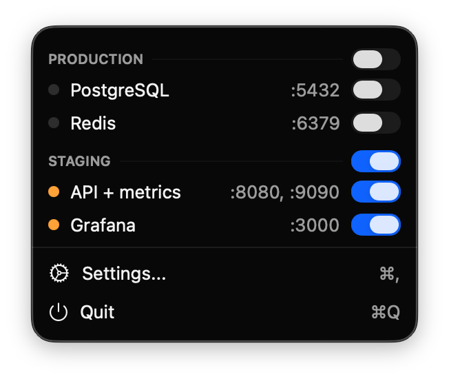
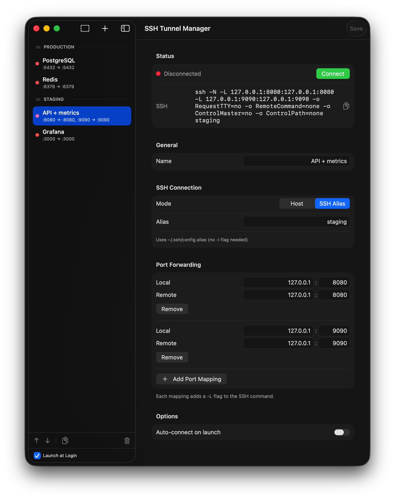
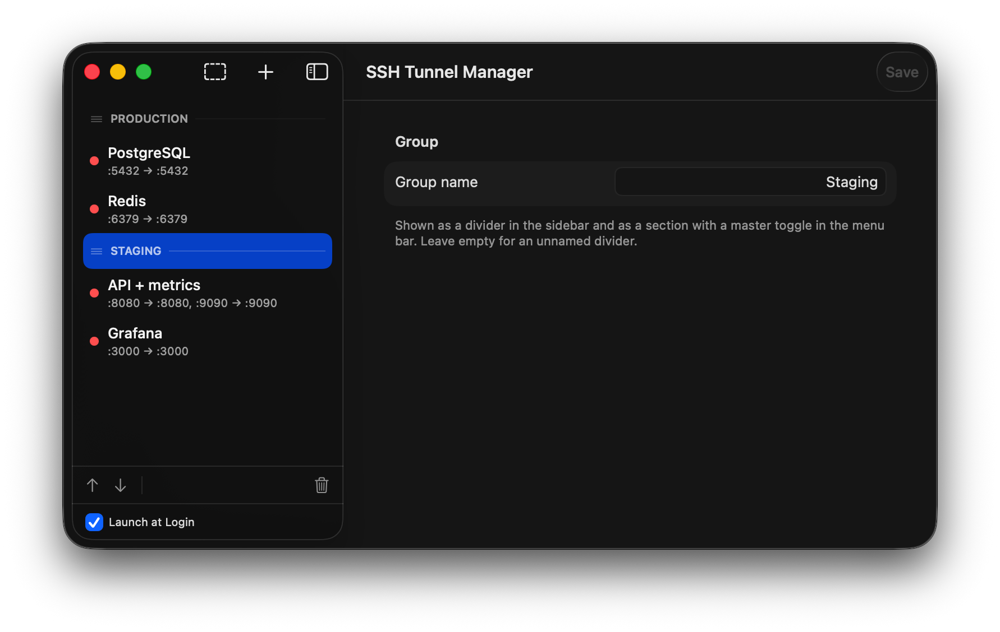

# SSH Tunnel Manager

A lightweight macOS menu bar app for managing SSH port forwards. No electron, no bloat — just native Swift and AppKit.

<p align="center">
  
</p>
<p align="center">
  
</p>
<p align="center">
  
</p>
<p align="center">
  
</p>

## Why?

If you work with remote servers, you constantly need SSH tunnels:
- Database access (`localhost:5432` → production PostgreSQL)
- Internal services (`localhost:8080` → staging API)
- A SOCKS proxy into a private network (`ssh -D`)

Running `ssh -N -L ...` in terminal works, but:
- You forget which tunnels are running
- They die silently when your laptop sleeps
- You need to remember the exact command for each tunnel

This app solves that. Configure once, connect with one click.

## Features

- **Menu bar app** — always accessible, no dock icon clutter
- **Multiple port forwards per tunnel** — one SSH connection, many `-L` mappings
- **SOCKS proxy** — per-mapping dynamic forwarding (`ssh -D`), mixable with local forwards
- **Group tunnels** — organize them with dividers and flip a whole group with one toggle
- **Auto-reconnect** — tunnels automatically reconnect when they drop
- **Connect/disconnect alerts** — optional sound and notification when a tunnel drops or comes back
- **Per-tunnel tuning** — override SSH `ConnectTimeout` / keepalive settings where a host needs it
- **SSH config aliases** — reuse hosts from your `~/.ssh/config`
- **Launch at login** — start tunnels when your Mac boots
- **Auto-connect** — mark tunnels to connect automatically on app launch
- **Native macOS** — uses system SSH, no bundled binaries

## Alternatives

| App | Issues |
|-----|--------|
| **Core Tunnel** | $10, closed source |
| **Secure Pipes** | Abandoned (last update 2019) |
| **SSH Tunnel Manager (Java)** | Requires JRE, clunky UI |
| **Termius** | Subscription model, overkill for just tunnels |
| **Manual terminal** | No auto-reconnect, easy to forget |

This app is free, open source, and does one thing well.

## Install

Download `SSHTunnelManager.dmg` from [Releases](../../releases).

On first launch, macOS will warn about unsigned app:
1. Right-click the app → Open, or
2. System Settings → Privacy & Security → Open Anyway

## Build from source

```bash
git clone https://github.com/0fuz/ssh-tunnel-manager.git
cd ssh-tunnel-manager/SSHTunnelManager
xcodebuild -scheme SSHTunnelManager -configuration Release
```

Requires Xcode 15+ and macOS 14+.

## Usage

1. Click the network icon in menu bar
2. Click "Settings" to add tunnels
3. Toggle tunnels on/off from the menu bar

Config is stored in `~/Library/Application Support/SSHTunnelManager/tunnels.json`.

### SOCKS proxy

Set a port mapping's type to **SOCKS** for a dynamic proxy (`ssh -D`). Point your browser, system proxy, or a tool at `127.0.0.1:<port>`. When the tunnel is connected, the detail view's **Usage** section has the address and `socks5h://` / `socks5://` URLs ready to copy.

Use `socks5h://` when DNS should be resolved **on the server** — e.g. to reach internal hostnames behind it; `socks5://` resolves DNS locally:

```bash
curl -x socks5h://127.0.0.1:1080 http://internal-host:8080
```

### Connection alerts

The app can play a sound and/or show a notification when a tunnel connects or drops unexpectedly. Toggle them in **Preferences** (the gear in the sidebar footer) — sounds are on by default, notifications off. Manual disconnects and config edits stay silent; only genuine drops alert.

Notifications need macOS permission. Turning **Show Notifications** on prompts for it the first time. If notifications still don't appear, open **System Settings → Notifications → SSH Tunnel Manager** and make sure **Allow Notifications** is on — for an unsigned build you may have to enable it there by hand.

## License

MIT
